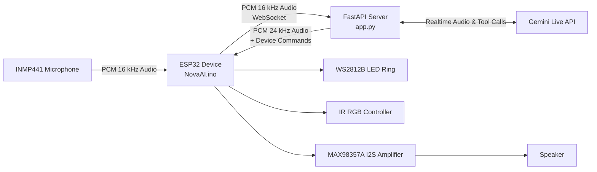

# NovaAI

[](https://youtu.be/atcwI0s3jn0)

<p align="center">
<b>▶ Click the thumbnail above to watch the 36-second demo.</b>
</p>

> An open-source ESP32-powered AI voice assistant built with FastAPI and Gemini Live, featuring real-time voice conversations, hardware control, and Gemini function calling.


NovaAI is an open-source ESP32-powered AI voice assistant that enables
natural, real-time conversations using Gemini Live.

It captures audio from an INMP441 microphone, streams it through a
FastAPI server, receives spoken responses, and controls physical
hardware such as RGB lighting in real time.

## Features

- Real-time voice conversations using Gemini Live
- ESP32 ↔ FastAPI WebSocket bridge
- INMP441 I2S microphone streaming (16 kHz PCM)
- MAX98357A I2S speaker playback (24 kHz PCM)
- Stream pacing and jitter buffering for smoother playback
- Barge-in support while Nova is speaking
- WS2812B LED ring status (Booting / Connecting / Listening / Thinking / Speaking)
- Gemini function calling
- IR-based RGB lighting control
- Graceful sleep/session handling

## ⭐ Support

If you found this project useful or interesting, consider giving it a ⭐ on GitHub. It helps more people discover the project and motivates further development.

## Why This Exists

Most AI assistants live behind apps, laptops, and cloud dashboards.
NovaAI explores what it takes to make an AI assistant feel physical:
always nearby, spoken to naturally, and capable of controlling real room
hardware.

The interesting part is not just calling an AI API. It is the full
pipeline:

-   capturing raw microphone audio on constrained hardware
-   streaming it over a local network
-   preserving low-latency conversational flow
-   handling interruptions while audio is already playing
-   turning AI tool calls into physical actions

## System Architecture



## Tech Stack

### Software

-   Python
-   FastAPI
-   Gemini Live
-   WebSockets

### Hardware

-   ESP32
-   INMP441
-   MAX98357A
-   WS2812B

### Protocols

-   I2S
-   PCM Audio
-   WebSockets

## Folder Structure

``` text
NovaAI/
├── app.py                    # FastAPI server, browser UI, Gemini bridge, ESP32 endpoint
├── NovaAI.ino                # ESP32 firmware for mic, speaker, LEDs, IR, WebSocket client
├── .env.example              # Example configuration values for a future env-based setup
├── .gitignore                # Python, Arduino, secret, and generated-file ignores
└── docs/
    ├── API.md
    ├── Architecture.md
    ├── Deployment.md
    ├── Diagrams.md
    ├── FutureIdeas.md
    ├── GitHubPolish.md
    ├── ProjectStructure.md
    ├── Protocol.md
    ├── Security.md
    └── Troubleshooting.md
```

## Installation

Clone the repository and install the Python dependencies:

``` bash
pip install fastapi uvicorn google-genai
```

For the ESP32 firmware, install these Arduino libraries:

-   `WebSocketsClient`
-   `Adafruit NeoPixel`
-   `IRremoteESP8266`
-   ESP32 board support package

## Configuration

For simplicity during development, some configuration values are
currently stored in source files.

Before production or wider deployment, these should be moved to
environment variables or external configuration files.

-   Wi-Fi SSID/password in `NovaAI.ino`
-   server IP and port in `NovaAI.ino`

For open-source use, move these values into environment variables or
local config files before publishing secrets. See
[.env.example](.env.example) and [docs/Security.md](docs/Security.md).

## Running Locally

Start the Python server:

``` bash
python app.py
```

The ESP32 connects to:

``` text
ws://<server-ip>:8000/esp32
```

## ESP32 Hardware Connections

### Hardware

| Component | Model |
|----------|-------|
| Microcontroller | ESP32 NodeMCU-32S |
| Microphone | INMP441 |
| Amplifier | MAX98357A |
| LED Ring | WS2812B (12 LEDs) |
| IR LED | 940nm IR LED |

### INMP441 I2S Microphone

| INMP441 | ESP32 |
|---------|-------|
| VCC | 3.3V |
| GND | GND |
| WS | GPIO 5 |
| SCK | GPIO 18 |
| SD | GPIO 32 |
| L/R | GND |

### MAX98357A I2S Amplifier

| MAX98357A | ESP32 |
|-----------|-------|
| VIN | 5V |
| GND | GND |
| LRC | GPIO 19 |
| BCLK | GPIO 21 |
| DIN | GPIO 22 |

Speaker:
- SPK+ → Speaker +
- SPK− → Speaker −

### WS2812B LED Ring

| WS2812B | ESP32 |
|----------|-------|
| DI | GPIO 4 |
| 5V | 5V |
| GND | GND |
| DO | Not Connected |

### IR LED

| IR LED | ESP32 |
|---------|-------|
| Anode (+) | GPIO 25 (through a current-limiting resistor) |
| Cathode (-) | GND |

### GPIO Summary

| GPIO | Purpose |
|------|---------|
| 4 | WS2812B LED Ring |
| 5 | INMP441 WS |
| 18 | INMP441 SCK |
| 19 | MAX98357A LRC |
| 21 | MAX98357A BCLK |
| 22 | MAX98357A DIN |
| 25 | IR LED |
| 32 | INMP441 SD |

> **Note:** All modules share a common ground.

## AI Server Setup

The FastAPI server acts as the bridge between the ESP32 hardware and
Gemini Live.

For every ESP32 connection, the server:

-   receives real-time PCM audio
-   forwards it to Gemini Live
-   streams generated speech back
-   executes Gemini tool calls
-   sends device commands (RGB, Sleep, etc.) to the ESP32

## Usage Examples

1.  Start the FastAPI server.
2.  Connect the ESP32 to the same Wi-Fi network.
3.  Upload the firmware.
4.  Power the device.
5.  Speak into the microphone.
6.  Receive spoken responses.
7.  Control connected hardware naturally.

## Documentation

-   [Architecture](docs/Architecture.md)
-   [API](docs/API.md)
-   [Protocol](docs/Protocol.md)
-   [Deployment](docs/Deployment.md)
-   [Troubleshooting](docs/Troubleshooting.md)
-   [Project Structure](docs/ProjectStructure.md)
-   [Developer Guide](docs/DeveloperGuide.md)
-   [Future Ideas](docs/FutureIdeas.md)
-   [Security](docs/Security.md)
-   [Diagrams](docs/Diagrams.md)
-   [GitHub Polish](docs/GitHubPolish.md)

## Future Roadmap

- Wake-word detection
- Lower end-to-end audio latency
- Improved IR transmission range
- Backend modularization
- Docker support
- Authentication for remote deployments

## Known Limitations

- Wake-word detection is still under development.
- Audio latency depends on network conditions.
- Some configuration values are currently hardcoded during development.
- IR transmission range can be improved with a transistor driver stage.

## Credits

Built by Parth.

NovaAI is an ongoing personal project exploring real-time AI, embedded
systems, and human-computer interaction.

## License

Licensed under the MIT License.
