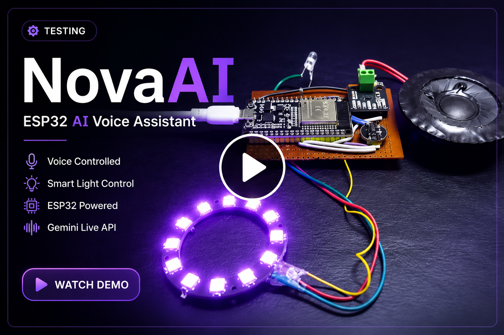
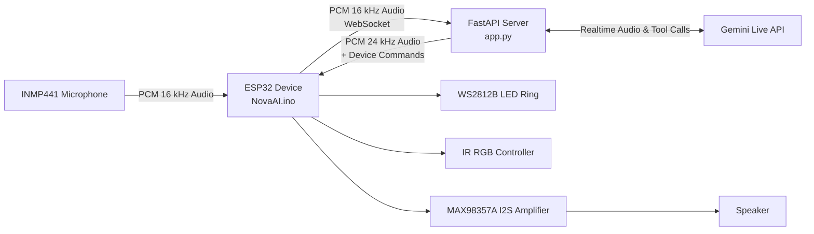

# NovaAI

[](assets/demo.mp4)

**🎥 Click the image above to watch the full 36-second demo.**

> An open-source ESP32-powered AI voice assistant built with FastAPI and Gemini Live.


NovaAI is an open-source ESP32-powered AI voice assistant that enables
natural, real-time conversations using Gemini Live.

It captures audio from an INMP441 microphone, streams it through a
FastAPI server, receives spoken responses, and controls physical
hardware such as RGB lighting in real time.

## 🎥 Demo

➡️ **[Watch the full 36-second demo](assets/demo.mp4)**

## Features

-   ESP32 hardware voice endpoint at `/esp32`
-   Gemini Live audio-to-audio conversation bridge
-   16 kHz PCM microphone input streaming
-   24 kHz PCM assistant audio playback
-   Barge-in handling with audio queue clearing
-   ESP32 I2S microphone support for INMP441
-   ESP32 I2S speaker output for MAX98357A
-   WS2812B LED ring state feedback
-   IR-based RGB lighting control tools
-   Graceful session close flow using Gemini function calls
-   ESP32-side jitter buffer and dedicated speaker task

## Why This Exists

Most AI assistants live behind apps, laptops, and cloud dashboards.
NovaAI explores what it takes to make an AI assistant feel physical:
always nearby, spoken to naturally, and capable of controlling real room
hardware.

The interesting part is not just calling an AI API. It is the full
pipeline:

-   capturing raw microphone audio on constrained hardware
-   streaming it over a local network
-   preserving low-latency conversational flow
-   handling interruptions while audio is already playing
-   turning AI tool calls into physical actions

## System Architecture



## Tech Stack

### Software

-   Python
-   FastAPI
-   Gemini Live
-   WebSockets

### Hardware

-   ESP32
-   INMP441
-   MAX98357A
-   WS2812B

### Protocols

-   I2S
-   PCM Audio
-   WebSockets

## Folder Structure

``` text
NovaAI/
├── app.py                    # FastAPI server, browser UI, Gemini bridge, ESP32 endpoint
├── NovaAI.ino                # ESP32 firmware for mic, speaker, LEDs, IR, WebSocket client
├── .env.example              # Example configuration values for a future env-based setup
├── .gitignore                # Python, Arduino, secret, and generated-file ignores
└── docs/
    ├── API.md
    ├── Architecture.md
    ├── Deployment.md
    ├── Diagrams.md
    ├── FutureIdeas.md
    ├── GitHubPolish.md
    ├── ProjectStructure.md
    ├── Protocol.md
    ├── Security.md
    └── Troubleshooting.md
```

## Installation

Clone the repository and install the Python dependencies:

``` bash
pip install fastapi uvicorn google-genai
```

For the ESP32 firmware, install these Arduino libraries:

-   `WebSocketsClient`
-   `Adafruit NeoPixel`
-   `IRremoteESP8266`
-   ESP32 board support package

## Configuration

For simplicity during development, some configuration values are
currently stored in source files.

Before production or wider deployment, these should be moved to
environment variables or external configuration files.

-   Wi-Fi SSID/password in `NovaAI.ino`
-   server IP and port in `NovaAI.ino`

For open-source use, move these values into environment variables or
local config files before publishing secrets. See
[.env.example](.env.example) and [docs/Security.md](docs/Security.md).

## Running Locally

Start the Python server:

``` bash
python app.py
```

The ESP32 connects to:

``` text
ws://<server-ip>:8000/esp32
```

## ESP32 Setup

Hardware used by the current firmware:

  Component      Purpose                 Pins
  -------------- ----------------------- -------------------------------
  INMP441        I2S microphone          WS `5`, SCK `18`, SD `32`
  MAX98357A      I2S speaker amplifier   LRC `19`, BCLK `21`, DIN `22`
  WS2812B ring   Nova state indicator    DATA `4`
  IR LED         RGB remote control      DATA `25`

Upload `NovaAI.ino` with the Arduino IDE after setting:

-   Wi-Fi SSID
-   Wi-Fi password
-   server IP address
-   server port

## AI Server Setup

The FastAPI server acts as the bridge between the ESP32 hardware and
Gemini Live.

For every ESP32 connection, the server:

-   receives real-time PCM audio
-   forwards it to Gemini Live
-   streams generated speech back
-   executes Gemini tool calls
-   sends device commands (RGB, Sleep, etc.) to the ESP32

## Environment Variables

The current code does not yet read environment variables. These are the
recommended variables for the next cleanup pass:

``` bash
GEMINI_API_KEY=your_gemini_api_key_here
NOVA_HOST=0.0.0.0
NOVA_PORT=8000
NOVA_MODEL=gemini-3.1-flash-live-preview
NOVA_VOICE=Aoede
ESP32_WIFI_SSID=your_wifi_name
ESP32_WIFI_PASSWORD=your_wifi_password
ESP32_SERVER_HOST=192.168.1.100
ESP32_SERVER_PORT=8000
```

## Usage Examples

1.  Start the FastAPI server.
2.  Connect the ESP32 to the same Wi-Fi network.
3.  Upload the firmware.
4.  Power the device.
5.  Speak into the microphone.
6.  Receive spoken responses.
7.  Control connected hardware naturally.

## Screenshots

> 🚧 The following visuals will be added soon:

-   Browser voice hub connected
-   ESP32 hardware build
-   Serial Monitor connection logs
-   LED ring in listening, thinking, and speaking states
-   RGB light control demo

## Planned Demo

> Suggested video timeline:

-   `0:00` - Hardware overview
-   `0:20` - Server startup
-   `0:35` - Browser voice demo
-   `1:10` - ESP32 wake and connection
-   `1:40` - Real-time voice conversation
-   `2:20` - Barge-in interruption
-   `2:45` - RGB light control
-   `3:10` - Goodbye and sleep flow

## Documentation

-   [Architecture](docs/Architecture.md)
-   [API](docs/API.md)
-   [Protocol](docs/Protocol.md)
-   [Deployment](docs/Deployment.md)
-   [Troubleshooting](docs/Troubleshooting.md)
-   [Project Structure](docs/ProjectStructure.md)
-   [Developer Guide](docs/DeveloperGuide.md)
-   [Future Ideas](docs/FutureIdeas.md)
-   [Security](docs/Security.md)
-   [Diagrams](docs/Diagrams.md)
-   [GitHub Polish](docs/GitHubPolish.md)

## Future Roadmap

-   Split server, prompts, tools, and frontend into separate modules
-   Add structured logging
-   Add authentication for WebSocket endpoints
-   Add a proper memory/session store
-   Add health checks and diagnostics
-   Add Docker deployment
-   Add PlatformIO support
-   Add CI for linting and docs checks
-   Add audio format negotiation and protocol versioning

## Known Limitations

-   API keys and Wi-Fi credentials are currently hardcoded and must be
    removed before public release.
-   WebSocket endpoints are unauthenticated.
-   Memory helper functions exist but are not currently wired into the
    session flow.
-   Wake-word detection is not yet implemented.
-   The ESP32 sleeps after a `SLEEP` command and does not currently
    implement a wake-word flow.
-   Audio tuning values are hardware and room dependent.

## Credits

Built by Parth.

NovaAI is an ongoing personal project exploring real-time AI, embedded
systems, and human-computer interaction.

## License

Licensed under the MIT License.
