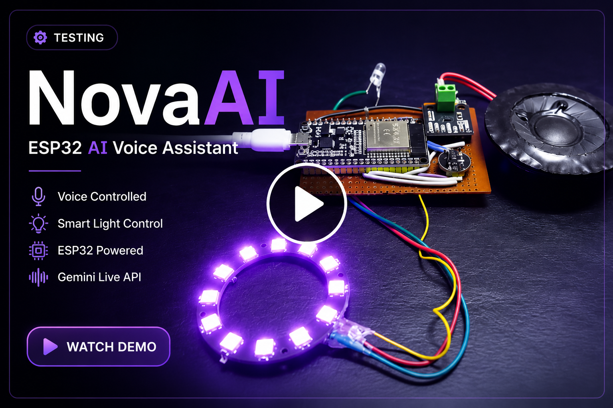
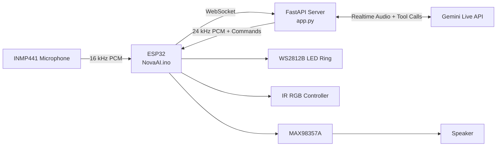

# NovaAI

[](https://youtu.be/atcwI0s3jn0)

<p align="center">
<b>▶ Click the thumbnail to watch the 36-second demo.</b>
</p>

> An open-source ESP32 AI voice assistant powered by Gemini Live, with real-time voice conversations, hardware control, and Gemini function calling.


NovaAI is a physical AI voice assistant built around an ESP32.

It captures your voice through an INMP441 microphone, streams the audio to a local FastAPI server, sends it to Gemini Live, and plays Gemini's response through a MAX98357A amplifier and speaker.

Nova can also control connected hardware through Gemini function calling, including an RGB lighting system.

## Features

- 🎙️ Real-time voice conversations with Gemini Live
- ⚡ ESP32 ↔ FastAPI WebSocket communication
- 🎧 INMP441 I2S microphone input at 16 kHz PCM
- 🔊 MAX98357A I2S speaker output at 24 kHz PCM
- 🗣️ Barge-in support while Nova is speaking
- 💡 WS2812B LED status indicators
- 🤖 Gemini function calling
- 💡 IR-based RGB lighting control
- 📡 Low-latency local network communication
- 😴 Graceful sleep/session handling

---

# Quick Start

This section is all you need to get NovaAI running.

## 1. Hardware

You will need:

| Component | Model |
|---|---|
| Microcontroller | ESP32 NodeMCU-32S |
| Microphone | INMP441 |
| Amplifier | MAX98357A |
| Speaker | 4Ω speaker |
| LED Ring | WS2812B, 12 LEDs |
| IR LED | 940nm IR LED |

Connect the hardware using the wiring diagrams below.

> **Important:** All modules must share a common ground.

---

## 2. Clone the Repository

```bash
git clone https://github.com/madebyparth/nova-ai.git
cd nova-ai
```

---

## 3. Install Python

NovaAI requires **Python 3.10 or newer**.

Check your Python version:

```bash
python --version
```

Then install the required dependencies:

```bash
pip install -r requirements.txt
```

---

## 4. Get a Gemini API Key

NovaAI uses the Gemini Live API.

1. Open [Google AI Studio](https://aistudio.google.com/)
2. Sign in with your Google account.
3. Create an API key.
4. Copy the key.

**Do not commit your API key to GitHub.**

Rename `.env.example` to `.env`:

```bash
mv .env.example .env
```

Then open the `.env` file and add your Gemini API key:

```env
GEMINI_API_KEY=your_gemini_api_key
```

`app.py` will load the API key from the `.env` file.

---

## 5. Configure Wi-Fi

Open:

```text
NovaAI.ino
```

Find the Wi-Fi configuration:

```cpp
const char* ssid = "your_wifi_name";
const char* password = "your_wifi_password";
```

Replace these with the Wi-Fi network that both your ESP32 and computer will use:

```cpp
const char* ssid = "MyWiFi";
const char* password = "mypassword123";
```

### Configure the Server IP

The ESP32 also needs to know where the FastAPI server is running.

Find the server address in `NovaAI.ino` and replace it with the **local IP address of the computer running `app.py`**.

For example:

```cpp
const char* server_ip = "192.168.1.100";
```

> Your ESP32 and computer must be connected to the same local network.

---

# 6. Install Arduino IDE

Download and install the latest Arduino IDE:

[Arduino IDE](https://www.arduino.cc/en/software)

Open:

```text
NovaAI.ino
```

### Install ESP32 Board Support

In Arduino IDE:

**File → Preferences**

Add the ESP32 board package URL to **Additional Boards Manager URLs**:

```text
https://raw.githubusercontent.com/espressif/arduino-esp32/gh-pages/package_esp32_index.json
```

Then:

**Tools → Board → Boards Manager**

Search for:

```text
esp32
```

Install **ESP32 by Espressif Systems**.

Select your board under:

**Tools → Board → ESP32 Arduino**

For example:

```text
ESP32 Dev Module
```

---

# 7. Install Required Arduino Libraries

Install these libraries through:

**Sketch → Include Library → Manage Libraries**

Required libraries:

- `WebSockets`
- `Adafruit NeoPixel`
- `IRremoteESP8266`

The ESP32 board package also provides the required I2S functionality.

---

# 8. Upload the Firmware

Connect the ESP32 to your computer using a **USB data cable**.

In Arduino IDE:

1. Select the correct COM port.
2. Select your ESP32 board.
3. Open `NovaAI.ino`.
4. Verify/compile the sketch.
5. Upload it to the ESP32.

After uploading, open:

**Tools → Serial Monitor**

Set the baud rate to the value configured in `NovaAI.ino`.

You should see the ESP32 connecting to Wi-Fi and attempting to connect to the FastAPI server.

---

# 9. Start the NovaAI Server

On the computer connected to the same Wi-Fi network:

```bash
python app.py
```

The FastAPI server will start and wait for the ESP32 WebSocket connection.

The ESP32 connects to:

```text
ws://<your-computer-ip>:8000/esp32
```

For example:

```text
ws://192.168.1.100:8000/esp32
```

Once connected:

1. Nova boots.
2. The LED ring shows the connection state.
3. Speak into the microphone.
4. Your audio is streamed to Gemini Live.
5. Gemini's response is streamed back to the ESP32.
6. Nova speaks through the connected speaker.

That's it.

---

# Hardware Wiring

## INMP441 Microphone

| INMP441 | ESP32 |
|---|---|
| VCC | 3.3V |
| GND | GND |
| WS | GPIO 5 |
| SCK | GPIO 18 |
| SD | GPIO 32 |
| L/R | GND |

## MAX98357A Amplifier

| MAX98357A | ESP32 |
|---|---|
| VIN | 5V |
| GND | GND |
| LRC | GPIO 19 |
| BCLK | GPIO 21 |
| DIN | GPIO 22 |

Speaker:

```text
SPK+ → Speaker +
SPK− → Speaker −
```

## WS2812B LED Ring

| WS2812B | ESP32 |
|---|---|
| DI | GPIO 4 |
| 5V | 5V |
| GND | GND |
| DO | Not connected |

## IR LED

| IR LED | ESP32 |
|---|---|
| Anode (+) | GPIO 25 |
| Cathode (-) | GND |

Use an appropriate current-limiting resistor and driver circuitry where required.

## GPIO Summary

| GPIO | Function |
|---:|---|
| 4 | WS2812B LED Ring |
| 5 | INMP441 WS |
| 18 | INMP441 SCK |
| 19 | MAX98357A LRC |
| 21 | MAX98357A BCLK |
| 22 | MAX98357A DIN |
| 25 | IR LED |
| 32 | INMP441 SD |

---

# How NovaAI Works


```mermaid
flowchart LR

Mic["INMP441 Microphone"]
ESP32["ESP32<br/>NovaAI.ino"]
Amp["MAX98357A"]
Speaker["Speaker"]
LED["WS2812B LED Ring"]
IR["IR RGB Controller"]

Server["FastAPI Server<br/>app.py"]
Gemini["Gemini Live API"]

Mic -->|16 kHz PCM| ESP32
ESP32 -->|WebSocket| Server
Server <-->|Realtime Audio + Tool Calls| Gemini
Server -->|24 kHz PCM + Commands| ESP32

ESP32 --> Amp
Amp --> Speaker
ESP32 --> LED
ESP32 --> IR
```

The ESP32 handles the physical side of Nova:

- microphone input
- speaker output
- LED animations
- IR transmission
- Wi-Fi communication

The FastAPI server handles the AI side:

- ESP32 WebSocket communication
- Gemini Live connection
- real-time audio streaming
- Gemini function calls
- hardware commands

This separation keeps the ESP32 lightweight while allowing the server to handle the heavier AI communication.

---

# Project Structure

```text
NovaAI/
├── app.py
├── NovaAI.ino
├── requirements.txt
├── .env.example
├── .gitignore
├── assets/
│   └── demo-thumbnail.png
└── docs/
    ├── API.md
    ├── Architecture.md
    ├── Deployment.md
    ├── Diagrams.md
    ├── FutureIdeas.md
    ├── ProjectStructure.md
    ├── Protocol.md
    ├── Security.md
    └── Troubleshooting.md
```

---

# Troubleshooting

### ESP32 does not connect to Wi-Fi

Check:

- Wi-Fi SSID and password
- ESP32 is within range
- the network is 2.4 GHz compatible
- the ESP32 is receiving power

### ESP32 connects to Wi-Fi but not the server

Check:

- your computer and ESP32 are on the same network
- the server IP in `NovaAI.ino` is correct
- `app.py` is running
- port `8000` is accessible through your firewall

### No audio input

Check the INMP441 wiring, especially:

```text
WS   → GPIO 5
SCK  → GPIO 18
SD   → GPIO 32
L/R  → GND
```

### No audio output

Check:

```text
LRC  → GPIO 19
BCLK → GPIO 21
DIN  → GPIO 22
```

Also verify the amplifier and speaker have the correct power and common ground.

### Gemini does not respond

Check that:

- your Gemini API key is configured correctly
- the API key has not expired/reached its limits
- the server is running
- the server has internet access

---

# Limitations

- Wake-word detection is still under development.
- Audio latency depends on network conditions.
- The current development configuration stores some values directly in source files.
- IR transmission range can be improved with a proper transistor driver stage.
- The project currently expects the FastAPI server to be running on a local computer.

---

# Roadmap

- [ ] Wake-word detection
- [ ] Lower end-to-end audio latency
- [ ] Improved IR transmission range
- [ ] Backend modularization
- [ ] Docker support
- [ ] Authentication for remote deployments
- [ ] More hardware integrations

---

# Documentation

For deeper technical details:

- [Architecture](docs/Architecture.md)
- [API](docs/API.md)
- [Protocol](docs/Protocol.md)
- [Deployment](docs/Deployment.md)
- [Troubleshooting](docs/Troubleshooting.md)
- [Project Structure](docs/ProjectStructure.md)
- [Security](docs/Security.md)
- [Diagrams](docs/Diagrams.md)
- [Future Ideas](docs/FutureIdeas.md)

---

# Credits

Built by **Parth**.

NovaAI is an open-source personal project exploring real-time AI, embedded systems, and human-computer interaction.

## License

Licensed under the MIT License.
