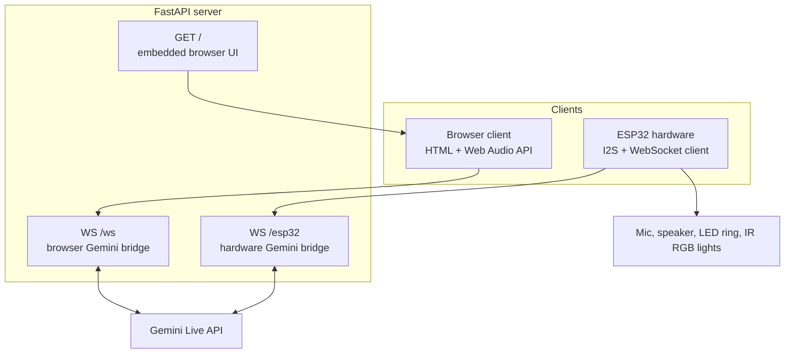
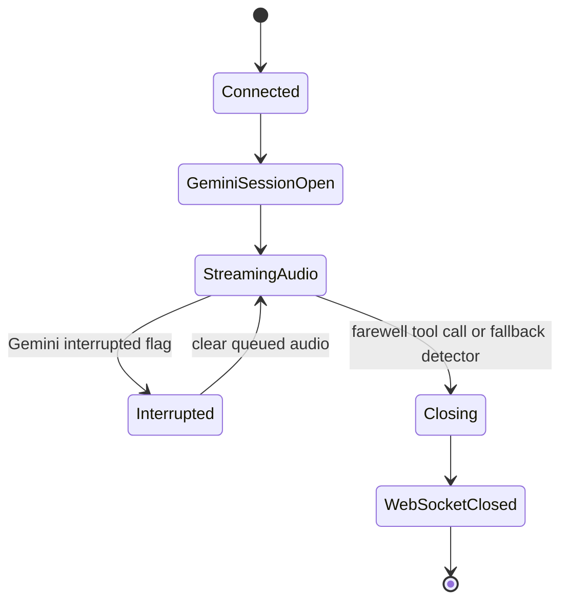

# Architecture

NovaAI has two major pieces:

1. A Python FastAPI server that acts as a real-time Gemini Live gateway.
2. An ESP32 firmware sketch that turns physical audio hardware, LEDs, and IR controls into a WebSocket-connected assistant device.

The project also includes a browser voice client embedded directly inside `app.py`. That browser client is useful for debugging the AI/audio path without the ESP32.

## High-Level Architecture

## Request Flow

### Browser Flow

1. The user opens `/`.
2. FastAPI returns an embedded HTML page.
3. The page opens `ws://<host>/ws`.
4. Browser microphone audio is captured with `getUserMedia`.
5. An `AudioWorkletProcessor` converts float microphone samples into 16-bit PCM chunks.
6. The browser sends PCM bytes to the server over the WebSocket.
7. The server forwards the audio to Gemini Live as `audio/pcm;rate=16000`.
8. Gemini returns model audio and optional text/tool metadata.
9. The server forwards audio bytes to the browser.
10. The browser converts 16-bit PCM into `AudioBuffer` objects and schedules playback.

### ESP32 Flow

1. The ESP32 boots, connects to Wi-Fi, initializes I2S mic/speaker, LEDs, and IR.
2. It opens a WebSocket to `/esp32`.
3. The main loop reads 16 kHz PCM samples from the INMP441 microphone.
4. A noise gate decides whether to send audio.
5. Audio is sent as binary WebSocket frames.
6. The server forwards audio to Gemini Live.
7. Gemini returns 24 kHz PCM speech and function calls.
8. The server queues and paces audio back to the ESP32.
9. The ESP32 stores incoming audio in a ring buffer.
10. A dedicated FreeRTOS speaker task writes audio to the MAX98357A over I2S.

## Communication Between Components

| Component | Talks To | Transport | Payload |
| --- | --- | --- | --- |
| Browser | FastAPI `/ws` | WebSocket | Binary PCM audio, text commands |
| ESP32 | FastAPI `/esp32` | WebSocket | Binary PCM audio, text commands |
| FastAPI | Gemini Live | Google GenAI SDK async live session | Realtime audio input, streamed responses |
| ESP32 | INMP441 | I2S RX | 16-bit mono PCM |
| ESP32 | MAX98357A | I2S TX | 16-bit mono PCM |
| ESP32 | WS2812B | GPIO | LED state colors |
| ESP32 | RGB controller | IR NEC codes | Light commands |

## Threading And Async Model

The Python server uses `asyncio`.

For `/ws`, the server creates two tasks:

- receive browser audio and send it to Gemini
- receive Gemini responses and send them to the browser

The tasks run until one completes, disconnects, or errors. The remaining task is cancelled.

For `/esp32`, the server creates three tasks:

- receive ESP32 audio and send it to Gemini
- receive Gemini responses and enqueue audio/tool commands
- pace queued audio chunks back to the ESP32

The ESP32 uses the Arduino `loop()` for WebSocket polling, microphone reads, LED updates, and audio sends. Speaker playback is moved into a FreeRTOS task pinned to core 1 so playback can continue while the main loop reads microphone data and handles WebSocket events.

## Memory Management

### Server

`app.py` defines `load_memory()` and `save_memory()` helpers around `memory.json`, but the current session flow does not call them. In the current implementation, conversation memory is effectively held inside each active Gemini Live session and is discarded when the WebSocket closes.

The browser client keeps short-lived playback structures:

- `audioQueue` for unscheduled audio buffers
- `activeSources` for currently scheduled playback sources
- `nextPlayTime` for gapless scheduling

The ESP32 endpoint keeps:

- an `asyncio.Queue` for outbound assistant audio
- an `asyncio.Event` used to clear audio during barge-in
- local session flags such as `hardware_active` and `session_closing`

### ESP32

The firmware uses a fixed 32 KB ring buffer for speaker audio. This avoids heap churn during real-time playback and makes overflow behavior predictable. When the buffer is full, the oldest bytes are dropped to make space for newer audio.

Access to the ring buffer is protected by a FreeRTOS mutex because it is written by the WebSocket event handler and read by the speaker task.

## ESP32 Interaction

The ESP32 is both an audio device and a physical output controller:

- microphone input from INMP441 over I2S
- speaker output to MAX98357A over I2S
- LED state display through WS2812B
- RGB room light commands through an IR LED

The server sends text commands such as `SLEEP`, `RGB_BLUE`, and `RGB_OFF`. The firmware interprets those commands in `webSocketEvent()`.

## WebSocket Flow

Binary frames are raw PCM audio. Text frames are control messages.

Browser endpoint:

- browser to server: 16 kHz PCM
- server to browser: 24 kHz PCM
- server to browser text: `CLEAR_AUDIO`, `CLOSE_SESSION`

ESP32 endpoint:

- ESP32 to server: 16 kHz PCM
- server to ESP32: paced 24 kHz PCM
- server to ESP32 text: `SLEEP`, `RGB_ON`, `RGB_OFF`, `RGB_RED`, `RGB_GREEN`, `RGB_BLUE`

## AI Interaction

Each WebSocket connection creates a Gemini Live session using:

- model: `gemini-3.1-flash-live-preview`
- response modality: audio
- voice: `Aoede`
- system instruction: Nova assistant personality, voice rules, location/timezone context, session-ending rules

The ESP32 endpoint includes extra function declarations for RGB lighting. When Gemini emits a tool call, the Python server maps it to a text command for the hardware.

## Session Lifecycle

For ESP32 sessions, `end_chat_session` maps to `SLEEP`, which disconnects the device and sets `is_sleeping = true`.
