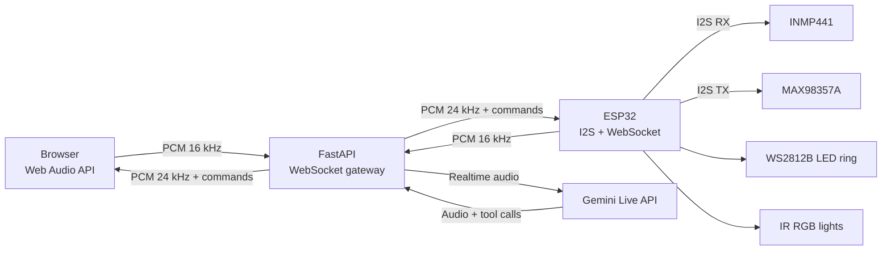
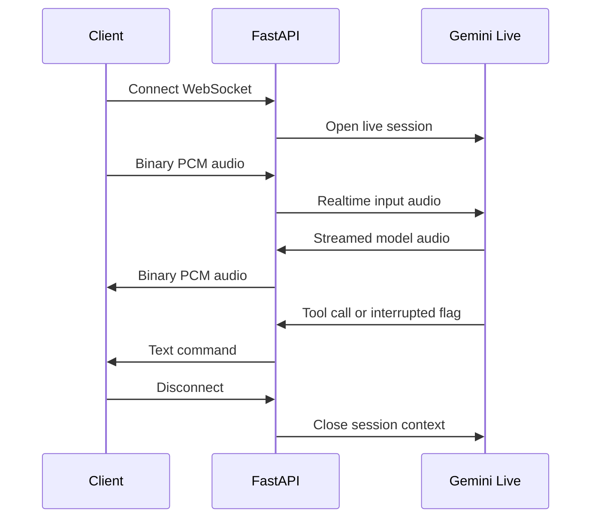
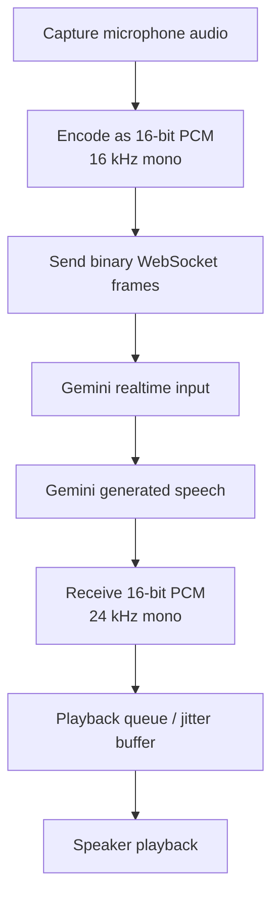
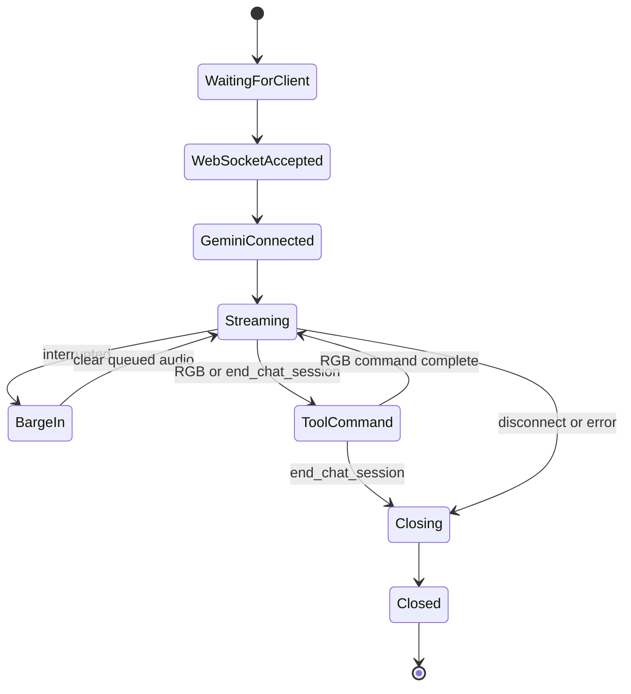
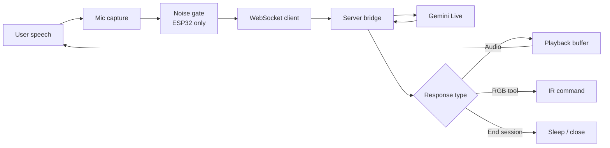

# Diagrams

## Overall Architecture

```mermaid
flowchart LR
    Browser["Browser<br/>Web Audio API"] -->|PCM 16 kHz| FastAPI["FastAPI<br/>WebSocket gateway"]
    ESP32["ESP32<br/>I2S + WebSocket"] -->|PCM 16 kHz| FastAPI
    FastAPI -->|Realtime audio| Gemini["Gemini Live API"]
    Gemini -->|Audio + tool calls| FastAPI
    FastAPI -->|PCM 24 kHz + commands| Browser
    FastAPI -->|PCM 24 kHz + commands| ESP32
    ESP32 -->|"I2S RX"| Mic["INMP441"]
    ESP32 -->|"I2S TX"| Speaker["MAX98357A"]
    ESP32 --> LED["WS2812B LED ring"]
    ESP32 --> IR["IR RGB lights"]
```

## WebSocket Communication

```mermaid
sequenceDiagram
    participant C as Client
    participant S as FastAPI
    participant G as Gemini Live

    C->>S: Connect WebSocket
    S->>G: Open live session
    C->>S: Binary PCM audio
    S->>G: Realtime input audio
    G->>S: Streamed model audio
    S->>C: Binary PCM audio
    G->>S: Tool call or interrupted flag
    S->>C: Text command
    C->>S: Disconnect
    S->>G: Close session context
```

## Audio Streaming Pipeline

```mermaid
flowchart TB
    Capture["Capture microphone audio"] --> PCM16["Encode as 16-bit PCM<br/>16 kHz mono"]
    PCM16 --> Upload["Send binary WebSocket frames"]
    Upload --> GeminiInput["Gemini realtime input"]
    GeminiInput --> GeminiOutput["Gemini generated speech"]
    GeminiOutput --> PCM24["Receive 16-bit PCM<br/>24 kHz mono"]
    PCM24 --> Queue["Playback queue / jitter buffer"]
    Queue --> Speaker["Speaker playback"]
```

## Session Lifecycle

```mermaid
stateDiagram-v2
    [*] --> WaitingForClient
    WaitingForClient --> WebSocketAccepted
    WebSocketAccepted --> GeminiConnected
    GeminiConnected --> Streaming
    Streaming --> BargeIn: interrupted
    BargeIn --> Streaming: clear queued audio
    Streaming --> ToolCommand: RGB or end_chat_session
    ToolCommand --> Streaming: RGB command complete
    ToolCommand --> Closing: end_chat_session
    Streaming --> Closing: disconnect or error
    Closing --> Closed
    Closed --> [*]
```

## Data Flow

```mermaid
flowchart LR
    User["User speech"] --> Mic["Mic capture"]
    Mic --> Gate["Noise gate<br/>ESP32 only"]
    Gate --> WSClient["WebSocket client"]
    WSClient --> Server["Server bridge"]
    Server --> AI["Gemini Live"]
    AI --> Server
    Server --> Commands{"Response type"}
    Commands -->|Audio| Playback["Playback buffer"]
    Commands -->|RGB tool| IR["IR command"]
    Commands -->|End session| Sleep["Sleep / close"]
    Playback --> User
```
