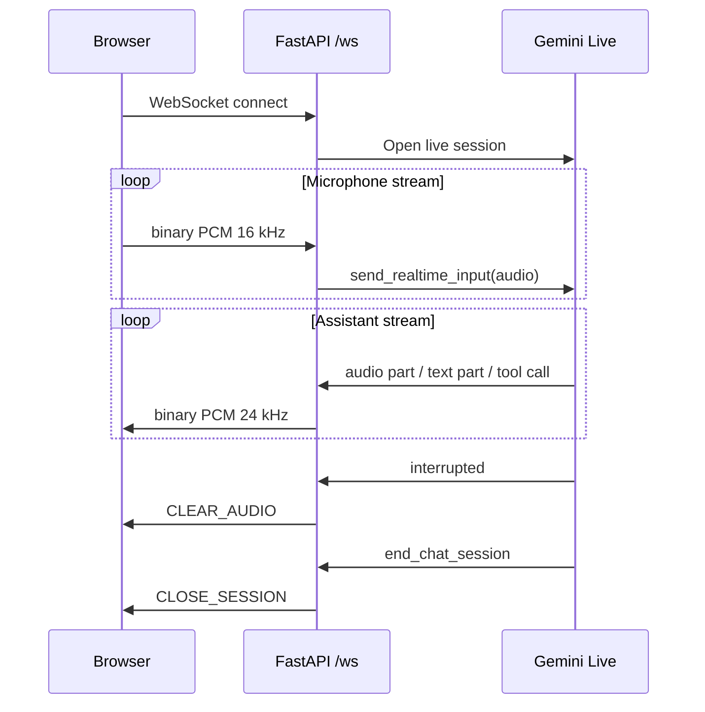
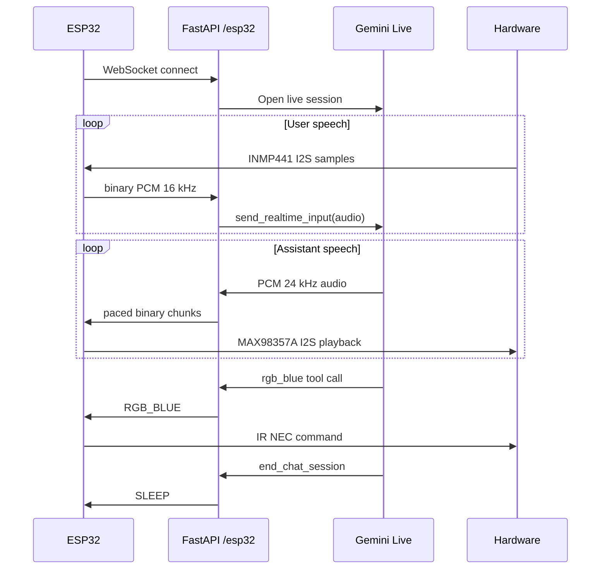

# Protocol

NovaAI uses a simple WebSocket protocol:

- binary frames are audio
- text frames are control commands

No JSON envelope is used for audio frames. This keeps the pipeline simple and low overhead.

## Audio Formats

| Direction | Sample Rate | Format | Channels |
| --- | --- | --- | --- |
| Browser/ESP32 to server | 16 kHz | signed 16-bit PCM | mono |
| Server to browser/ESP32 | 24 kHz | signed 16-bit PCM | mono |

## Browser Protocol



## ESP32 Protocol



## Control Commands

### Browser Commands

| Command | Sender | Receiver | Description |
| --- | --- | --- | --- |
| `CLEAR_AUDIO` | server | browser | Stop queued audio after barge-in. |
| `CLOSE_SESSION` | server | browser | Close the UI session after farewell. |

### ESP32 Commands

| Command | Sender | Receiver | Description |
| --- | --- | --- | --- |
| `SLEEP` | server | ESP32 | Disconnect and enter sleeping state. |
| `RGB_ON` | server | ESP32 | Turn RGB lights on through IR. |
| `RGB_OFF` | server | ESP32 | Turn RGB lights off through IR. |
| `RGB_RED` | server | ESP32 | Set RGB lights red through IR. |
| `RGB_GREEN` | server | ESP32 | Set RGB lights green through IR. |
| `RGB_BLUE` | server | ESP32 | Set RGB lights blue through IR. |

## Audio Streaming Pipeline

```mermaid
flowchart LR
    Mic["Microphone<br/>browser or INMP441"] --> Capture["PCM capture<br/>16 kHz mono"]
    Capture --> WSUp["Binary WebSocket frames"]
    WSUp --> Server["FastAPI bridge"]
    Server --> Gemini["Gemini Live<br/>realtime input"]
    Gemini --> AudioOut["Generated audio<br/>24 kHz PCM"]
    AudioOut --> WSDown["Binary WebSocket frames"]
    WSDown --> Playback["Browser AudioContext<br/>or ESP32 ring buffer"]
    Playback --> Speaker["Speaker output"]
```



## Versioning Recommendation

The current protocol is implicit. Before wider adoption, add a small text handshake such as:

```json
{
  "type": "hello",
  "protocol": "novaai.v1",
  "input_audio": "pcm_s16le_16000_mono",
  "output_audio": "pcm_s16le_24000_mono"
}
```

That would make future browser, ESP32, and mobile clients easier to evolve independently.
